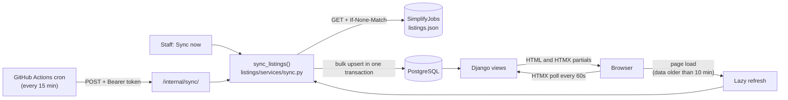

# Internship Tracker

[](https://github.com/vicjr555/internship-tracker/actions/workflows/tests.yml)

A Django app that mirrors live **Summer 2027 tech internship postings** and tracks my own applications in one place.

As a CS student recruiting for internships, I was juggling a GitHub list of thousands of postings, a spreadsheet of where I'd applied, and no good way to tell which postings had quietly closed. This app keeps a near-real-time copy of the community-maintained [SimplifyJobs](https://github.com/SimplifyJobs/Summer2027-Internships) list: new postings show up within about 15 minutes and closed ones disappear. It also tracks each application through Applied → OA → Interview → Offer, with stats on both the market and my own funnel.

## Features

- **Live postings**: about 3,200 Summer 2027 postings synced from the source (about 2,100 open at a time), newest first, with a **NEW** badge for postings first seen in the last 24 hours.
- **Filters**: keyword (company or title), location (`Denver`, `Remote`, or a state code like `CO`), category, posted within 1/3/7/30 days, and "hide ones I've tracked". Results update as you type, and the URL can be bookmarked.
- **Live updates without reloading**: the page polls every 60 seconds and shows *"3 new postings · 2 closed since you loaded this page"* with a **Refresh list** button, plus *"Last synced 4 minutes ago"*.
- **One-click tracking**: the **Track** button saves a posting to your pipeline without a page reload.
- **My Applications**: change status inline from a dropdown. Every change is recorded in a status history. Postings that close upstream stay in your list, labeled **Closed** with the date.
- **Stats**: new postings per week, top hiring companies, top locations, and median days a posting stays open. Plus your personal funnel with conversion rates, median days from Applied to OA, and applications per week.
- **Staff sync dashboard**: recent sync runs with counts and errors, and a **Sync now** button.
- **Admin**: every model is registered in the Django admin with filters and search.

## Screenshots

*Screenshots coming soon.*

<!-- To add screenshots: save PNGs to docs/screenshots/ and uncomment this table.
| Postings | My applications | Stats |
|---|---|---|
|  |  |  |
-->

## Tech stack

| Layer | Choice |
|---|---|
| Backend | Python 3.11, Django 5.2 |
| Database | PostgreSQL in production, SQLite locally (switched by `DATABASE_URL` via `dj-database-url`) |
| Frontend | Django templates, [HTMX](https://htmx.org) for partial page updates, [Pico.css](https://picocss.com), [Chart.js](https://www.chartjs.org) (all via CDN) |
| HTTP | `requests` with ETag conditional requests |
| Scheduling | GitHub Actions cron → protected sync endpoint |
| Testing | pytest + pytest-django, run against PostgreSQL in CI |
| Hosting | Render (gunicorn + WhiteNoise) |

## Architecture



The code is split into four Django apps:

- `listings`: the mirrored postings, the sync service and its audit log (`Listing`, `SyncRun`, `SyncState`).
- `applications`: your pipeline (`Application`, `StatusChange`).
- `stats`: market and personal statistics.
- `accounts`: signup.

Business logic lives in `services.py` modules, so views stay thin and the same code runs from a view, a management command or a test.

## How sync works

All sync logic is in [`listings/services/sync.py`](listings/services/sync.py), behind one function, `sync_listings()`. Three things call it:

- the `manage.py sync_listings` command;
- the protected `/internal/sync/` endpoint;
- a lazy refresh when the listings page loads with stale data.

**1. ETag conditional requests.** The source is a ~13 MB JSON file. The app stores the `ETag` from the last successful download and sends it back as `If-None-Match`. If nothing has changed, GitHub answers `304 Not Modified` with no body, and the sync stops there: no download, no database writes. The new ETag is saved in the same transaction as the data, so a failed sync never marks unprocessed data as seen.

**2. Bulk upserts.** Instead of one query per posting, the sync:

- loads every existing listing into a dict keyed by the source's stable `id`, in one query;
- works out in memory which postings are new, changed, closed or reopened;
- writes the results with `bulk_create` and `bulk_update` in batches of 500.

The whole write happens in a single `transaction.atomic()` block, so a failure halfway through rolls everything back. Re-syncing identical data makes zero changes.

**3. Soft deletion.** Postings are never deleted. A posting is closed (`is_active=False`, `closed_at=now`) when any of these happens:

- it's marked `active: false` in the source;
- it's hidden in the source;
- it disappears from the source;
- it loses its Summer 2027 tag.

If it comes back, it's reopened. History is kept for stats, and `Application.listing` uses `on_delete=PROTECT`, so your applications always survive. As a safeguard, an empty source file is treated as an error rather than a reason to close every posting.

**4. Locking.** A single-row `SyncState` table holds a `locked_at` timestamp. A sync claims the lock with one conditional `UPDATE ... WHERE locked_at IS NULL OR locked_at < now - 10 min`. The database guarantees only one caller wins, and this works on both SQLite and PostgreSQL. Because the lock is a timestamp, a lock left behind by a crashed process expires on its own.

Every attempt is recorded in `SyncRun` with its status (`success`, `not_modified`, `failed`) and counts: in source, new, updated, closed and reopened.

**Keeping it fresh on a free host that sleeps:**

- A [GitHub Actions workflow](.github/workflows/sync.yml) POSTs to `/internal/sync/` every 15 minutes. The request carries a bearer token, which the app checks with a constant-time comparison.
- Separately, if someone loads the page and the last successful sync is more than 10 minutes old, the page syncs first. After a failed attempt it waits 2 minutes before trying again.

## Local setup

```bash
git clone https://github.com/vicjr555/internship-tracker.git
cd internship-tracker
python -m venv .venv
source .venv/bin/activate          # Windows: .venv\Scripts\activate
pip install -r requirements.txt
cp .env.example .env               # then set SECRET_KEY and SYNC_TOKEN
python manage.py migrate
python manage.py sync_listings     # first sync: about 2 seconds
python manage.py createsuperuser   # optional: admin + sync status page
python manage.py runserver
```

Open <http://localhost:8000>. Run `python manage.py sync_listings --force` to ignore the stored ETag.

## Running tests

```bash
pytest
```

There are 74 tests covering:

- sync behavior: creating, updating, soft-closing, reopening, 304s, network and JSON errors, transaction rollback, and locking;
- the token-protected endpoint;
- lazy refresh and the live poller;
- filters, tracking, application ownership and status history;
- stats aggregation, including a check that personal stats use a fixed number of queries;
- an admin smoke test.

HTTP is always mocked, and a fixture blocks any real network access. [CI](.github/workflows/tests.yml) runs the suite against PostgreSQL 16 on every push and fails if a migration is missing.

## Deployment (Render, free tier)

1. **Deploy the Blueprint.** In Render, choose **New → Blueprint** and pick this repo. [`render.yaml`](render.yaml) creates the web service and a PostgreSQL database. [`build.sh`](build.sh) installs dependencies, collects static files and runs migrations.
2. **Set the admin account.** When prompted, set `DJANGO_SUPERUSER_USERNAME`, `DJANGO_SUPERUSER_EMAIL` and `DJANGO_SUPERUSER_PASSWORD`. The free tier has no shell, so `build.sh` creates the admin account from these on the first deploy.
3. **Add the GitHub secret and variable.** In the GitHub repo, under **Settings → Secrets and variables → Actions**:
   - Secret `SYNC_TOKEN`: copy the value Render generated for the service's `SYNC_TOKEN`.
   - Variable `SYNC_URL`: `https://<your-service>.onrender.com/internal/sync/`

   The sync workflow is skipped until `SYNC_URL` is set.
4. **Test the cron.** Go to **Actions → Sync listings → Run workflow**. It should print a JSON summary.

### Environment variables

| Variable | Where | Purpose |
|---|---|---|
| `SECRET_KEY` | Render (auto-generated) | Django cryptographic signing |
| `DATABASE_URL` | Render (from the database) | PostgreSQL connection string |
| `DEBUG` | Render: `False` | Turns on secure cookies, HTTPS redirect and HSTS |
| `SYNC_TOKEN` | Render (auto-generated) **and** GitHub secret | Shared secret for `/internal/sync/` |
| `ALLOWED_HOSTS` | Render (optional) | Extra hostnames. The `*.onrender.com` hostname is added automatically from `RENDER_EXTERNAL_HOSTNAME`. |
| `CSRF_TRUSTED_ORIGINS` | Render (optional) | Extra origins, e.g. a custom domain |
| `DJANGO_SUPERUSER_USERNAME` / `_EMAIL` / `_PASSWORD` | Render | Admin account created on first deploy |
| `SYNC_URL` | GitHub **variable** | Full URL of `/internal/sync/`. It turns on the cron workflow. |
| `LISTINGS_SOURCE_URL`, `LISTINGS_TERM` | Optional | Point at next year's repo and term |

**Free-tier notes:**

- Render's free web services sleep after 15 minutes idle. The 15-minute cron mostly keeps the app awake, which fits within the 750 free instance-hours a month.
- Render's free PostgreSQL expires after 30 days; upgrade it or recreate it.
- GitHub pauses scheduled workflows in repos with no activity for 60 days.

## Known limitations

- **Median days open** only counts postings the app saw open *and* then saw close. Postings that were already closed at the first sync are excluded, so this stat builds up over time.
- Location search is a substring match on the JSON list, with special handling for two-letter state codes. With more data I'd add a search column or use PostgreSQL full-text search.

## Credits

Posting data comes from the [SimplifyJobs / Pitt CSC Summer 2027 Internships](https://github.com/SimplifyJobs/Summer2027-Internships) repository, maintained by Simplify and the Pitt Computer Science Club community. This project isn't affiliated with them.
